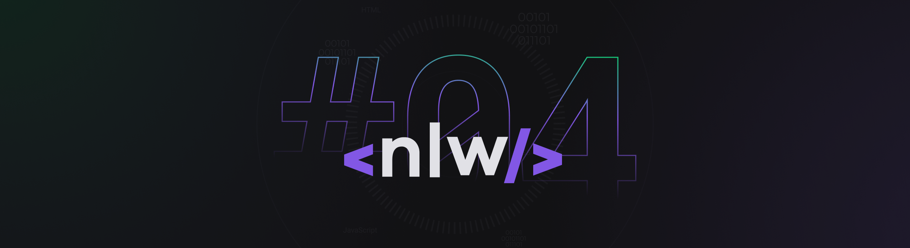

<div>
    <div align="center">
        <h2>NLW-4</h2>
    </div>
    <hr>
    <div align="center">
        
    </div>
    Esse projeto foi desenvolvido durante a trilha de NodeJS, na quarta edição da NLW. Aprendemos conceitos sobre o que é um API, como iniciar um projeto utilizando Typescript e Express para gerenciamento das rotas, TypeORM para manipulação dos dados, testes automatizados e envio de e-mail.
</div>

#  🚀 Tecnologias Utilizadas

-  TypeScript
-  Ethereal-Email
-  Express
-  TypeORM


# ⚙️ Como executar

-   Clone o repositório
```bash
    $ git clone 'repository'
```
-   Instale as dependências com yarn
```bash
    $ npm i
```
-   Inicie o servidor com yarn dev
```bash
    $ npm run
```
A aplicação pode ser acessada em localhost:3333.

# 📝 Sobre

As aulas foram ministradas pela **[Daniele Leão](https://github.com/danileao)** instrutora da [Rocketseat](https://rocketseat.com.br/)